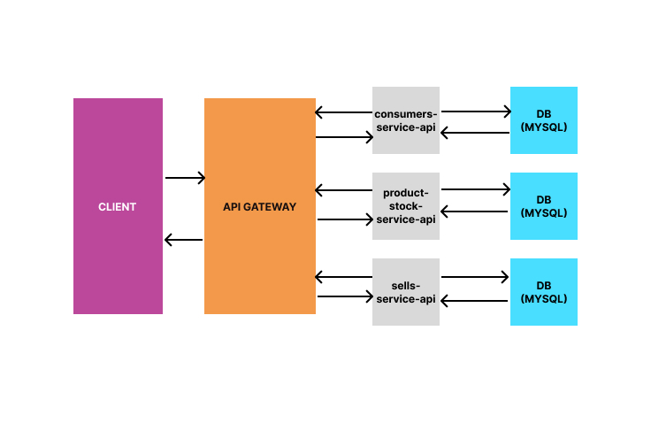

# Store Software With SOA

- A SOA (Services Oriented Archtecture) made using RESTful APIs and API Gateway design pattern;

- The API Gateway pattern was used in order to routing requests from client to respectively api in the system.

- The archtecture was made with 4 services:

  - api-gateway;
  - consumers-service-api;
  - product-stock-service-api;
  - sells-service-api.

- The Spring (Java) and Express (Node.js) frameworks were used to develop the services. The criteria for choosing technologies were based on what was most comfortable for developers, as the concept of SOA is agnostic to the type of platform/technology being used in development;

- A point to highlight is that the use of more than one technology in the development of different services shows the heterogeneity in a Distributed System;

- Finally, this work was carried out as a requirement for the A3 assessment of the Distributed Systems course.

## Architecture



## Installing project

### 1. Cloning

```sh
git clone git@github.com:matheusdoedev/todo-list-manager-api.git
```

## Running system

### 0. Docker e Docker Compose

- You need to download and install docker and docker compose in order to run the system.

### 1. Running

```sh
docker-compose -d --build up
```

## Documentation

### API Gateway Endpoints

#### Insomnia

- Download Insominia and import [api-gateway.json](./api-gateway/api-gateway.json).

### APIs (Services)

- [API Gateway](./api-gateway/README.md)
- [consumers-service-apicodigo-fonte/customers-service-api/README.md)
- [product-stock-service-api](./product-stock-service-api/README.md)
- [sells-service-api](./sells-service-api/README.md)

## Technologies

- Java
- Spring framework
- Spring MVC
- Spring Data JPA
- SpringDoc/Swagger
- MySQL
- Node.js
- Express
- Sequelize
- Axios
- Dockerfile
- Docker Compose

## Contributing

1. Fork it (<git@github.com:matheusdoedev/store-software-with-soa.git>)
2. Create your feature branch (`git checkout -b feature/fooBar`)
3. Commit your changes following conventional commits pattern (`git commit -am 'feat: add some feature'`)
4. Push to the branch (`git push origin feature/fooBar`)
5. Create a new Pull Request
